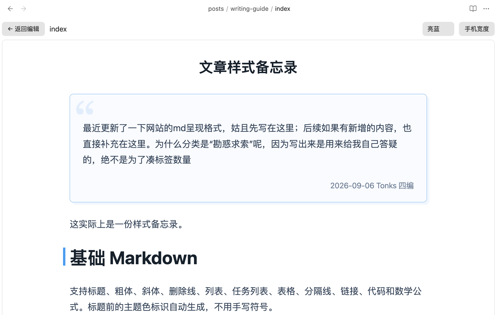
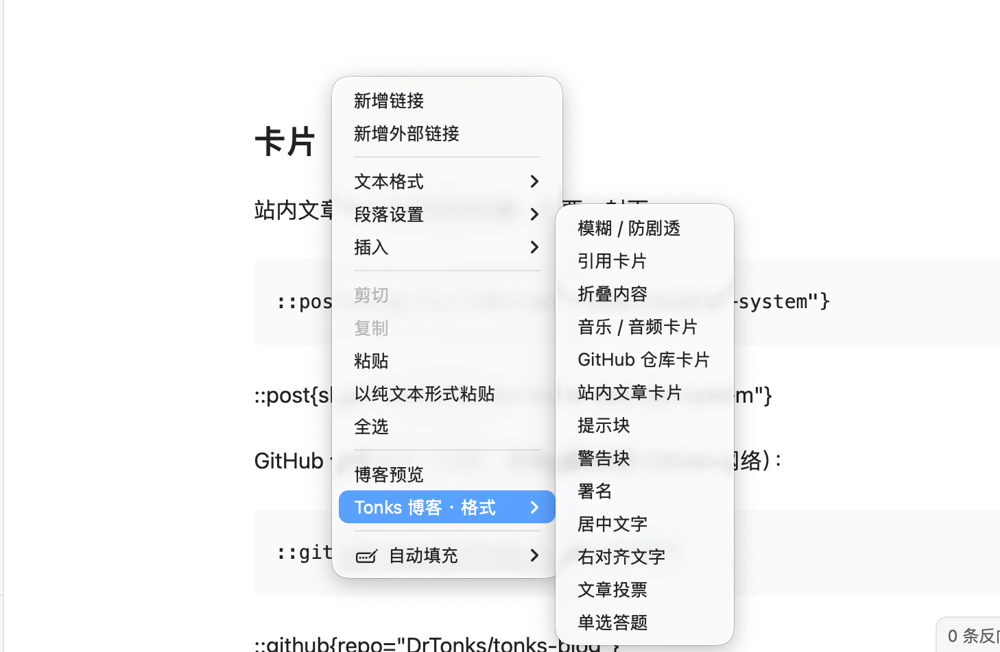
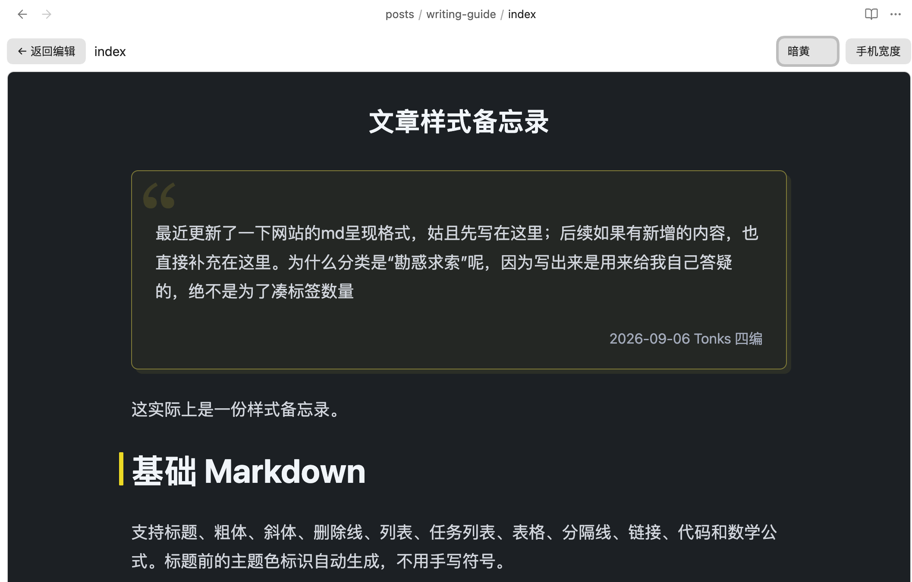
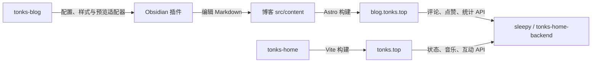

# Tonks Obsidian Editor

在 Obsidian 里写博客、插入专属格式，并按需预览文章。插件读取博客提供的 JSON 菜单与本地渲染适配器，无需启动 Astro 开发服务器。

**桌面端 Obsidian 1.5.0+ · 插件 ID：`tonks-blog-tools` · 当前版本：0.2.0**

[安装到博客](#安装到博客) · [格式配置](https://github.com/DrTonks/tonks-blog/blob/main/editor/README.md) · [开发记录](DEVELOPMENT.md) · [更新日志](CHANGELOG.md)

## 界面预览

在 Obsidian 内查看博客样式与主题，按需预览当前文章：



<details>
<summary>查看右键格式菜单、参数表单与暗色预览</summary>

选中文字后，从右键菜单选择博客格式：



可以通过表单填写格式参数。

切换暗色主题，检查同一篇文章的呈现：



</details>

## 写作体验

- **右键插入格式**：菜单从博客配置即时读取，选中文字后可包裹为博客指令，也可插入独立卡片。
- **表单代替手填语法**：字段、默认值与校验由配置声明；文章卡片可通过文章搜索器选择。
- **一键预览**：左侧书本图标或右键“博客预览”打开当前编辑内容的快照，再次切换返回编辑。
- **主题跟随博客**：当前适配器提供亮蓝、亮黄、暗蓝、暗黄四种预览主题。
- **格式随博客演进**：JSON 和 CSS 更新后重新打开菜单或预览即可；修改适配器 JS 后只需重建博客侧适配资源。

## 项目地图

这四个项目共同组成 Tonks 的个人站点与写作工具，各自保留独立仓库、依赖与发布流程。按需要克隆即可，无需额外的总仓库。

| 项目 | 职责 | 使用入口 |
| --- | --- | --- |
| [tonks-home](https://github.com/DrTonks/tonks-home) | 个人主页、状态卡片、音乐与桌宠交互 | [tonks.top](https://tonks.top/) |
| [tonks-blog](https://github.com/DrTonks/tonks-blog) | 文章、主题、静态构建与博客预览适配器 | [blog.tonks.top](https://blog.tonks.top/) |
| [tonks-home-backend](https://github.com/DrTonks/tonks-home-backend) | 主页与博客共享的状态、统计、评论等 API | 源码目录常用名 `sleepy` |
| [tonks-obsidianEditor](https://github.com/DrTonks/tonks-obsidianEditor) | Obsidian 格式插入、表单与按需博客预览 | 安装到博客 `src/content/.obsidian/plugins/tonks-blog-tools/` |



博客可单独构建静态页面；动态互动需要后端。Obsidian 插件是可选的本地写作工具，不参与线上服务，也不要求启动 Astro。博客仓库的本地目录沿用 `blogExample`，与 GitHub 上的 `tonks-blog` 是同一个项目。

## 安装到博客

以下使用两个相邻目录，兼容安装脚本与集成测试的默认路径：

```text
workspace/
├── blogExample/                   # DrTonks/tonks-blog
│   ├── editor/                    # 格式配置、CSS 和预览适配器
│   └── src/content/               # 在 Obsidian 中打开这个目录
│       ├── posts/
│       └── .obsidian/plugins/tonks-blog-tools/
└── tonks-obsidianEditor/           # 本仓库：插件源码
```

首次使用时，在同一个父目录克隆两个项目；已有博客则直接复用：

```bash
git clone https://github.com/DrTonks/tonks-blog.git blogExample
git clone https://github.com/DrTonks/tonks-obsidianEditor.git
```

1. 用 Obsidian 将 `blogExample/src/content` 打开为仓库，使其生成 `.obsidian/` 目录。
2. 在博客目录构建预览适配器：

   ```bash
   cd blogExample
   npm install --prefix editor
   pnpm editor:build
   ```

3. 在插件目录构建并安装：

   ```bash
   cd ../tonks-obsidianEditor
   npm ci
   npm run build
   npm run install:content
   ```

4. 在 Obsidian 的第三方插件设置中启用 **Tonks 博客工具**。插件设置中的博客根目录可留空自动向上查找，配置路径默认为 `editor/blog-editor.json`。升级插件后停用再启用一次。

安装脚本要求目标已存在 `.obsidian/`，只复制 `dist/` 内的 `main.js`、`manifest.json` 和 `styles.css`。自定义位置可设置 `TONKS_VAULT`，或手动复制这三个文件到 `<vault>/.obsidian/plugins/tonks-blog-tools/`。

```bash
# macOS / Linux：替换为自己的 Obsidian 仓库路径
TONKS_VAULT=/path/to/blog/src/content npm run install:content
```

```powershell
# Windows PowerShell
$env:TONKS_VAULT = 'C:\path\to\blog\src\content'
npm run install:content
```

## 维护边界

| 修改内容 | 所在项目 | 生效方式 |
| --- | --- | --- |
| 格式名称、顺序、字段与默认值 | 博客 `editor/blog-editor.json` | 重新打开菜单 |
| 正文样式与预览 CSS | 博客 | 重新打开预览 |
| 格式解析与预览交互 | 博客 `editor/` 及共享解析模块 | `pnpm editor:build` 后重新打开预览 |
| Obsidian 菜单、表单、设置与容器 | 本插件 | 构建、安装并重新启用插件 |

预览是按需快照，不会随每次输入自动刷新；返回编辑后再打开即可更新。新增博客格式先阅读 [博客适配器维护指南](https://github.com/DrTonks/tonks-blog/blob/main/editor/README.md)。

## 开发与验证

| 文件 | 职责 |
| --- | --- |
| `config.mjs` | 配置加载与校验 |
| `formats.mjs` | 模板生成与插入计算 |
| `main.js` | Obsidian 菜单、表单、设置与预览 |
| `styles.css` | 插件工具栏与容器样式 |
| `build.mjs`、`install.mjs` | 打包与定向安装 |

```bash
npm ci
npm run build
npm test
```

集成测试依赖相邻 `blogExample/editor` 的配置及已构建适配器；插件构建本身不依赖博客。博客适配器测试在博客目录运行 `pnpm editor:test`。

## 当前限制

- 仅支持桌面 Obsidian，需要本地文件系统和可信的博客适配模块。
- 当前博客适配器的 GitHub 卡片为离线展示，代码块使用基础渲染，Mermaid 显示源码；预览不能替代整站验收。
- 插件会执行配置指定的本地适配模块，只应连接自己维护或信任的博客代码。文章原文不会作为模块执行。
- 自动测试覆盖配置、模块热更新、模板与 DOM 集成；真实 Obsidian 的菜单、插入及撤销流程仍需单独验收。
